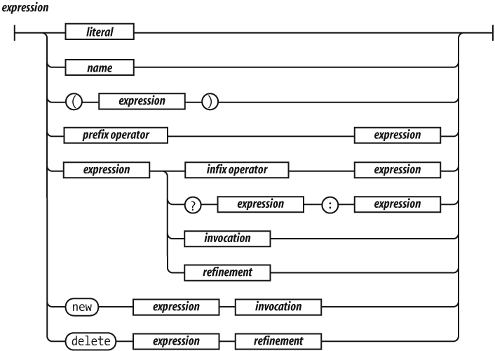

!SLIDE
# 2: Operators & Expressions

!SLIDE bullets incremental
# Classifying operators

* _Arity_ (number of operands)
* _Fixity_ (prefix, infix or postfix)
* _Kind_ (type of operation)

!SLIDE bullets incremental
# Operator arity

* Unary: `typeof foo`
* Binary: `bar instanceof baz`
* Ternary: `x ? y : z`

!SLIDE bullets incremental
# Operator fixity

* Prefix: `new Date`
* Infix:  `a % b`
* Postfix: `f++`

!SLIDE smbullets incremental
# Operator kinds

* Arithmetic operators
* Assignment operators
* Comparison operators
* Logical operators
* String operators
* Member operators
* Special operators

!SLIDE smbullets incremental
# Type coercion and truthiness

* Comparison operators perform _type coercion_
* `>`, `<`, `>=`, `<=`, `==`, `!=`
* `==` uses an equality comparison algorithm
* Strict equality operators `===` and `!==` check for type and value equality
* Logical operators and conditionals check for _truthiness_
* `false`, `undefined`, `NaN`, `''`, `0` and `null` are _falsy_
* Every other value is _truthy_

!SLIDE smbullets incremental
# Short circuits

* `&&` and `||` are short-circuit operators
* Short-circuit operations evaluate to the _stopping expression_
* `5 || 6` evaluates to `5`
* `undefined || null` evaluates to `null`
* `"foo" && "bar"` evaluates to `"bar"`
* `NaN && true` evaluates to `NaN`

!SLIDE bullets incremental
# Expressions

* Expressions are defined _recursively_
* Expressions can be _values_
* Expressions can be _compositions_ of operators and other expressions

!SLIDE center

_Source: _JavaScript: The Good Parts _by Doug Crockford_

!SLIDE smbullets incremental
# Operator precedence

* The set of operators has a _partial order_
* `*` has a higher precedence than `+`
* `4 + 3 * 2 === 10`
* In general, arithmetic operators have high precedence
* Logical operators have low precedence
* Use parentheses to convey intent in long expressions
